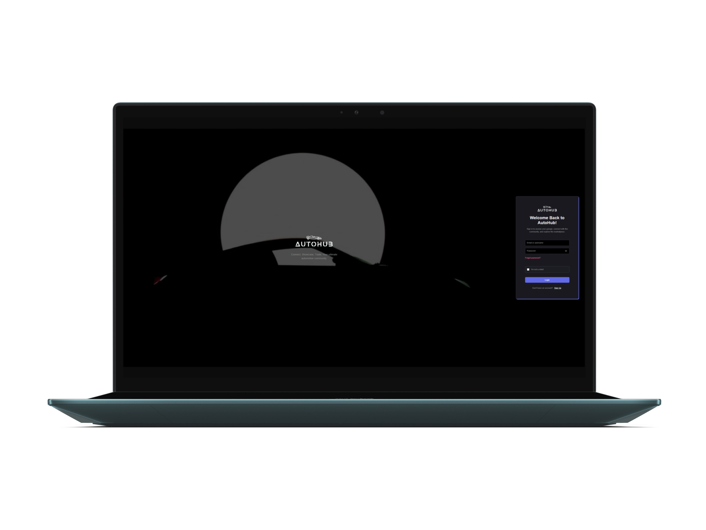
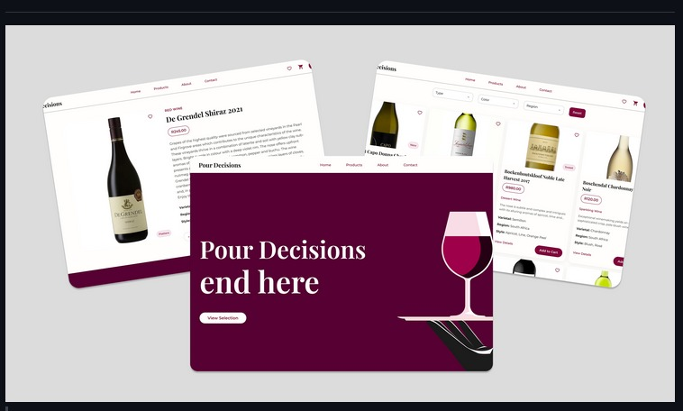
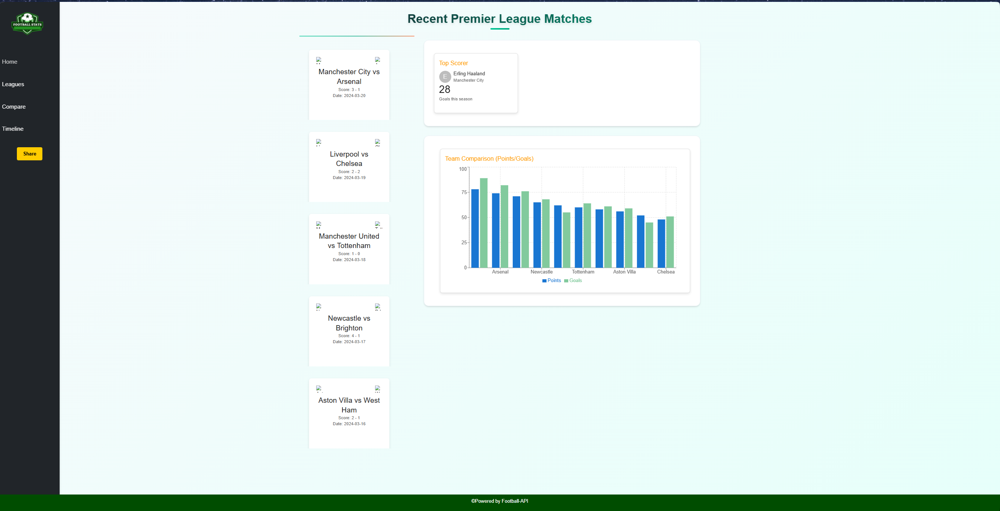

<p align="center">
  
</p>


<h1 align="center">Francois le Roux</h1>

<p align="center"> Final-Year Interactive Development Student · Aspiring Software Developer · Pretoria, South Africa </p>

<p align="center"> Building web applications with JavaScript, C#, .NET and modern frontend technologies while growing my skills through real-world projects. </p>

<!-- <p align="center">
  
  
  
  
  
</p> -->

---

## About Me

```javascript
const francois = {
  education: "Final-Year Creative Technology Student",
  specialisation: "Interactive Development",
  location: "Pretoria, South Africa",

  background: [
    "UI/UX Design",
    "Frontend Development",
    "Software Development"
  ],

  currentlyLearning: [
    "Git & GitHub",
    ".NET Development",
  ],

  currentGoal:
    "Build strong software development skills, grow my portfolio, and secure a graduate or junior developer role.",

  interests: [
    "Web Applications",
    "User Experience Design",
    "Problem Solving",
    "Continuous Learning"
  ]
};

console.log(francois);
```
## Currently Working On:
- Cisco JavaScript Essentials
- Strengthening JavaScript fundamentals
- Building portfolio projects
- Seeking graduate and junior developer opportunities

## Most Recent Project

### VELOURS

A luxury wedding apparel and fashion website built using HTML, CSS and JavaScript.

**Why I Built It**

VELOURS was created to strengthen my frontend development skills by building a complete responsive website from concept to deployment. The project challenged me to work with modern layouts, responsive design principles, user interface interactions, and deployment workflows.

**What I Learned**

* Structuring larger frontend projects
* Responsive design techniques
* CSS animations and transitions
* JavaScript DOM manipulation
* Git and deployment workflows
* Debugging real-world frontend issues

**Tech Stack**

* HTML5
* CSS3
* JavaScript
* Git
* GitHub
* Vercel

**Future Improvement**
* Convert the site to the React framework using Tailwind.css.

🔗 Live Demo: [[Velours](https://velours-eight.vercel.app)]

🔗 Repository: [GitHub Repository](https://github.com/231256leRouxFNF/VELOURS)

---

## University Projects (Portfolio of 2025)

## Automotive Hub
 
🔗 Repository: [Automotive Hub](https://github.com/231256leRouxFNF/AutomotiveHub-DV200)
- A social platform designed for car, motorcycle, and vehicle enthusiasts to connect, share content, and engage with the automotive community.

- **Why I Built It**
Built to explore community-driven applications, user interaction patterns, and frontend development within a niche automotive community.

Technologies Used:  
- **JavaScript**
- **CSS** 
- **HTML**

**Key Areas Explored**
- User profiles
- Community engagement
- Social platform design
- Frontend development



## Wine E-Commerce Site

🔗 Repository: [Wine E-Commerce](https://github.com/231256leRouxFNF/Wine-Ecommerce-site)
- A collaborative university project focused on building an online wine retail experience.

**Why We Built It**
Developed as a team project to explore e-commerce workflows, product discovery, user experience design, and collaborative software development practices.

Technologies Used:  
- **JavaScript** 
- **CSS** 
- **HTML**



## Football Stats Tracker 

🔗 Repository: [Football Stats Tracker](https://github.com/231256leRouxFNF/formative-one-football-stats)
- An app for tracking football statistics, fetching dynamic data from APIs, and presenting it in a clean and intuitive interface. Features responsive visualizations and highlights key performance metrics designed to demonstrate data-driven interactions effectively.

- Why I Built It:
  Created to learn API integration, data visualization and dynamic content rendering using JavaScript.
  
 Technologies Used:  
- **JavaScript** 
- **CSS**
- **HTML**
  


---

## GitHub stats
<p align="center">
  
  
</p>

---

## Contributions & Streak
<p align="center">
  
  <br /><br />
  
</p>

---

## Connect
<p align="center">
  <a href="[https://www.linkedin.com/in/your-linkedin](https://www.linkedin.com/in/francois-le-roux-2415182a5/)" target="_blank">
    
  </a>
  <a href="mailto:francoislerouxdev@gmail.com" target="_blank">
    
  </a>
</p>

---
